<p align="center">
  <a href="" rel="noopener">
 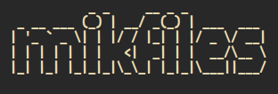</a>
</p>

<h3 align="center">mikfiles</h3>

<div align="center">

[]()
[](https://github.com/bangrezz/The-Documentation-Compendium/issues)


[](/LICENSE)

</div>

---

<p align="center"> MikroTik downloader for log file, configuration file, and backup file with automatic cron.
    <br> 
</p>

## 📝 Table of Contents

- [About](#about)
- [Getting Started](#getting_started)
- [Usage](#usage)
- [Built Using](#built_using)
- [Authors](#authors)
- [Gallery]()
- [Acknowledgments](#acknowledgement)

## 🧐 About <a name = "about"></a>
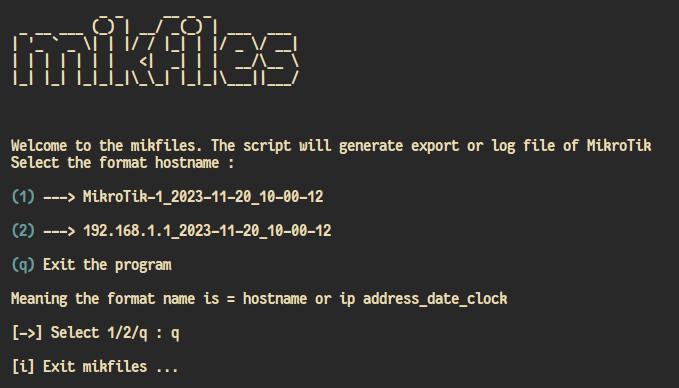

Mikfiles can download :
- Log file
- Configuration file
- Backup file 
#### And support for automation download with Linux cron
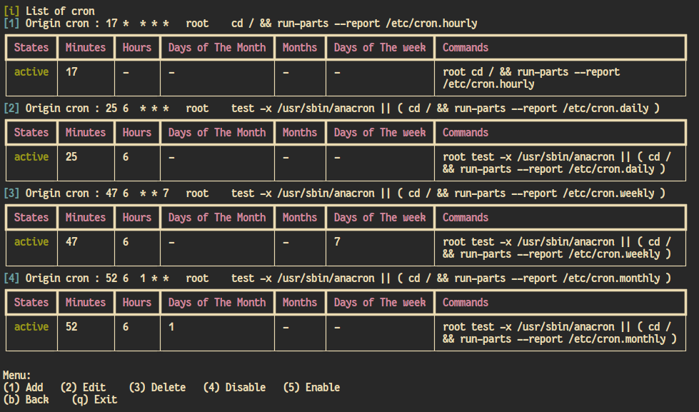
This can add, edit, delete, enable, disable cron configuration. But, "add" menu only can 1 cron to add.

## 🏁 Getting Started <a name = "getting_started"></a>

These instructions will get you a copy of the project up and running on your local machine for development and testing purposes.

### Prerequisites

Mikfiles currently full worked on Linux. Because it using cron to unlock feature automatic schedule downloading file. But you can try to downloading file with mikfiles using Windows, macOS, and Android (Termux) if possible.

### Installing

A step by step series of examples that tell you how to get a development env running.

Install the python on your system :
- Ubuntu/Debian
```
sudo apt install python3
```
- Fedora/RedHat
```
sudo dnf install python3
```
- Arch/Manjaro
```
pacman -S python
```
- Other OS visit ` https://www.python.org/downloads/` to spesific version


Say what the step will be

```
cd mikfiles/
pip install -r requirements.txt
```

End with an example of getting some data out of the system or using it for a little demo.

## 🎈 Usage <a name="usage"></a>

### How to use mikfiles to downloading file
- if you using Linux and want to edit cron
```
sudo python3 mikfiles.py
```
- if you using Linux, Windows, macOS, or Android (via Termux)
```
python3 mikfiles.py
```
Then follow all instructions on mikfiles

## ⛏️ Built Using <a name = "built_using"></a>

- 🐍 [Python](https://www.python.com/) - All code using python

## ✍️ Authors <a name = "authors"></a>

- [@bangrezz](https://github.com/bangrezz) - Idea & Initial work

## 🖼️ Gallery Mikfiles
  
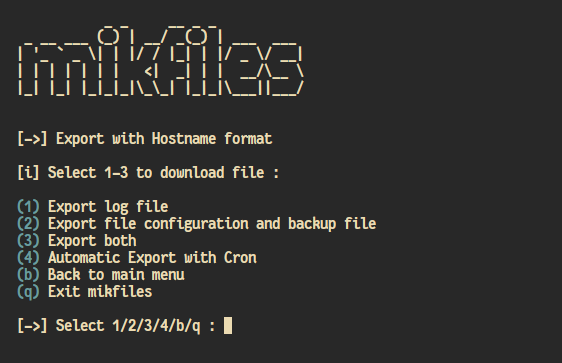
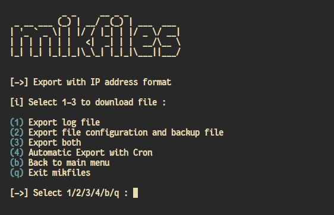
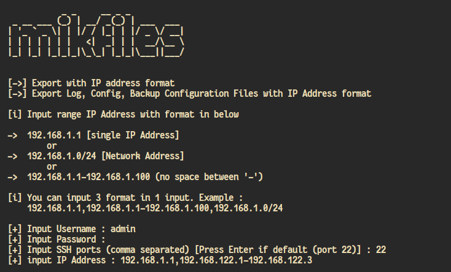  
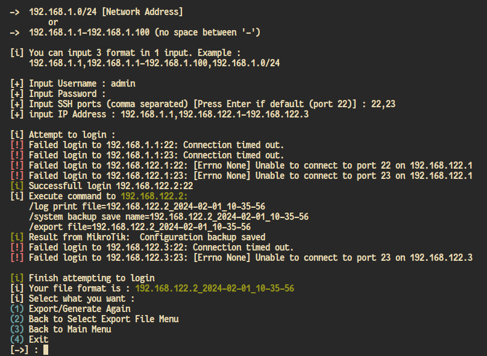
## Automatic Download with Cron - mikfiles feature
 
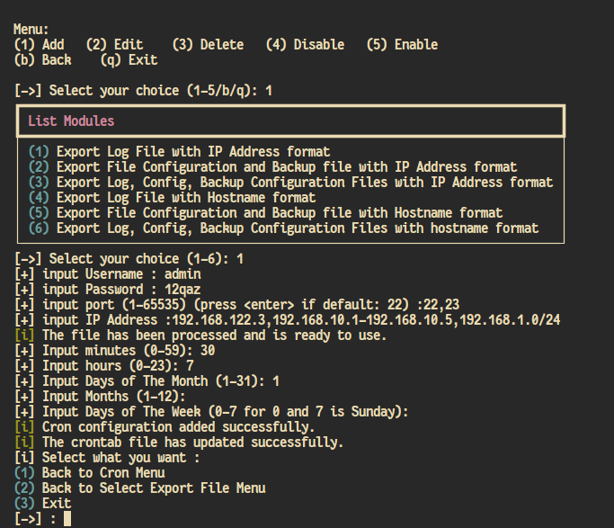 
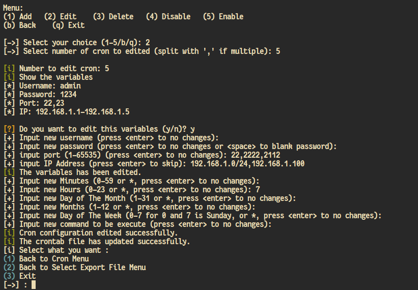 
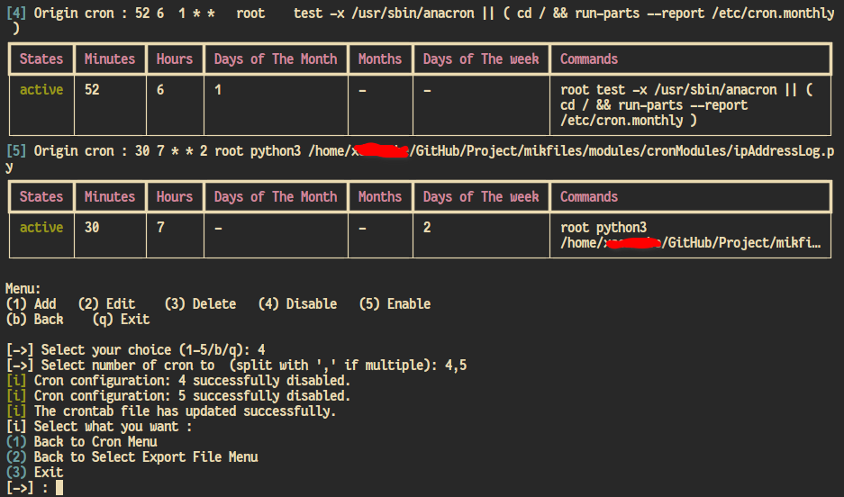 
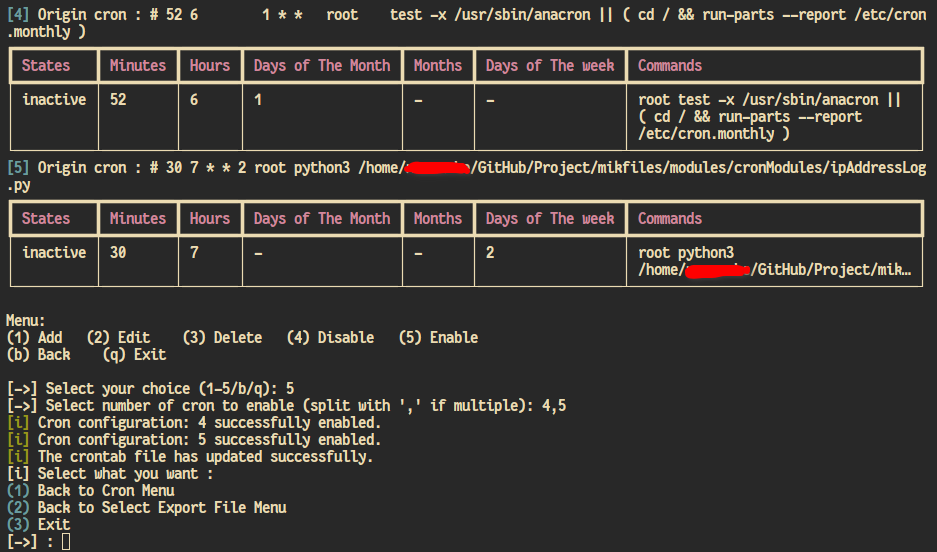 
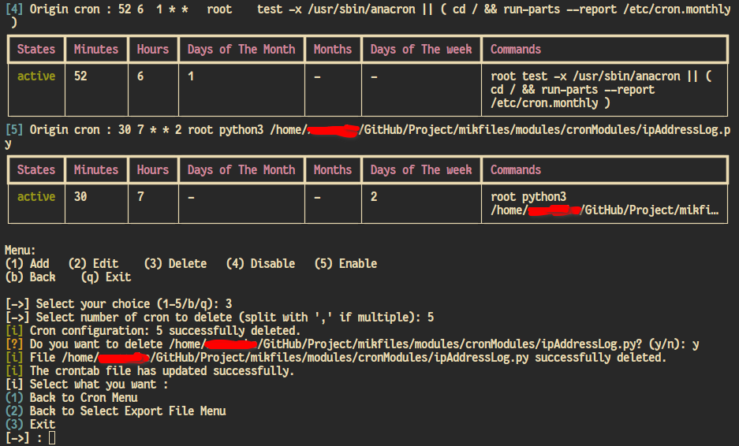

## 🎉 Acknowledgements <a name = "acknowledgement"></a>

- MikfoTik Wiki https://wiki.mikrotik.com/wiki/Main_Page
